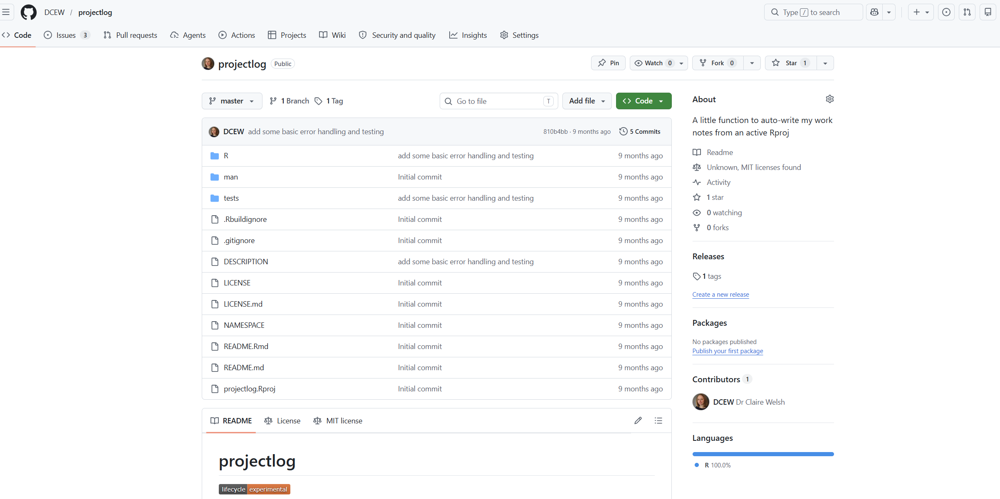
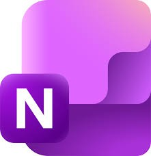
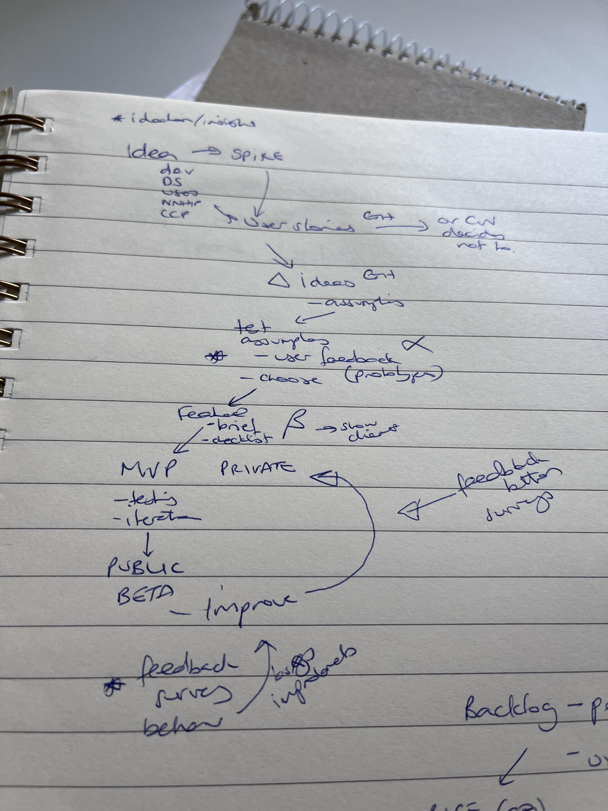

{fig.alt="Joy from the move Inside Out hugging a 'core memory'" width="100%"}

In our data science team, we recently started having fortnightly ‘side-quests and 
support’ meetings. RD
The whole team is invited, and the blurb that goes along with the invite is: 
"This meeting is a chance for the team to get together informally and discuss 
their work, get help unsticking tricky elements, show off cool things they've 
done, air worries and find solutions. We all benefit from having some idea of 
the work of others, can spot areas of duplication and pick up on the use of 
skills we want to acquire. 
If you're picked to present, use your time how you like - tell us about what's 
bothering you, what you're proud of, issues with how the team are working, the 
wider Unit, or anything you'd like us to know.” 

We’ve grown to really value this hour, and lots of interesting ideas and 
positivity fall out of them. We try to avoid talking about BAU work, so that we 
can have a little and celebrate each other’s’ unique flavours of nerdery.  
Some recent highlights have been an app that was built to find optimal walking 
routes between pubs and landmarks, an auto-generated personal blog website with 
great photos and a notebook to analyse football statistics.

Recently, one of the topics we discussed was how we each maintain a healthy 
‘brain plate’ – meaning how we ensure we are not relying on memory to ensure we 
do all the things we need/want to. 

Our team is a mix of coders, managers, designers and consultants, and we all 
approach similar problems differently. 
This blog is a set of mini interviews with our lovely team members to capture 
the different ways we manage our working lives.

#

#

#

#

##[Picture of EK](EK.png){fig-align="right"} Eirini: AI Agent Herder 

## How do I manage my work knowledge and tasks? 

### To-do list and notes 📋

Capitalising on the flexibility our team offers and the encouragement to explore new ideas and technologies, 
I've written two lightweight CLI tools to help me keep organised. [Poke](https://github.com/ai-mindset/poke) 
is a WIP attempt to bridge the gap of GitHub's more lightweight project management capabilities with some of 
the powerful constructs Azure DevOps Boards offer. Given that Poke requires a bit more TLC to serve my intended 
purpose, I've opted for a more lightweight CLI solution in the meantime: [Task](https://github.com/ai-mindset/task).
Both projects, organisation aside, have acted as a "wet lab" that allow experimentation with 
[Deno](https://deno.com/) with TypeScript) and [Rust](https://rust-lang.org/) - in search of a single, compact, 
batteries-included language outside the Python realm, that'll be my hammer to hit most nails. More on that another time.

_Task_ allows me to create a to-do list and notes in a single, lightweight, easily backed up Markdown file. It has worked well for me so far. Poke, using JSON for maintaining hierarchy, will allow me to keep local notes under GitHub Issues, similar to Tasks created under Azure DevOps Board work items. 

### Emails 📩

I use Outlook (classic), as a more lightweight email client. It's a feature-rich tool, sometimes unnecessarily 
rich. Thus, I simply keep an Outlook window on one side of my screen, for email and meeting notifications. 

GitHub notifications over email have felt overwhelming at times, therefore I set up a list of filters to redirect GitHub notifications accordingly. This system has had varying levels of success, hence I've reverted to tweaking my GitHub notifications and simply receive notification emails in my inbox. 

At the end of each day, I strive to get most pending emails addressed or at least lined up for the next day if they're not urgent.

### GitHub

I always have a web browser window open with two or three GitHub tabs to help me have an overview of my current 
workload. One tab with my GitHub issues, another tab containing PRs, a third tab listing my Notifications. 
Filters are very useful since they allow me to categorise and organise my work accordingly. They help reduce the noise and maintain my focus on tasks requiring my attention.

### Solveit

My daily driver and AI harness of choice is [Solveit](https://solve.it.com/); a fusion between literate programming and agentic AI forming an editable dialogue between the user and the language model. Solveit is my thinking partner, that helps me plan, research, interrogate, dissect and distil knowledge. It also helps me examine, improve, fix and architect new code.  

### Other tools

I do not use pen and paper, or other tools outside the minimal list above. This is by choice, as experience has shown 
that maintaining a minimal and focused toolbox helps me keep reasonably organised.
It also allows me to leverage a wider range of computers (older, with constrained resources), as most of my tools are lightweight, easy to install and free. Finally, I favour plain markdown or JSON - if hierarchy is required - as they are portable and universal formats.
The majority of my time is spent in a terminal window - aligning with the team's nerdery - and my web browser running Solveit and GitHub tabs.

#

#

#

## {width="10%" fig-align="right"} Claire: Lead Data Scientist 

## How do I store my meeting notes and thoughts/ideas? 🧠

### Quarto book

I use a Quarto book to store all my meeting notes and thoughts. 
It’s tracked with git locally for version control, but because it includes line 
management notes, it can’t be safely deployed. 
I separate topics into different markdown files. 
Each entry in a file is started with the date (in ‘yyyy-mm-dd’ format) as a 
heading. 
The whole thing is searchable at once (using the keyboard shortcut of CTRL>Shift>F). 
I also record bits of positive feedback for myself to go back to when I need a 
boost🥰, and a separate page for useful little hints and tips for myself. 
I write into this book during meetings, but any actions are immediately added to
my OneNote list.

### Helpers

I did write a little basic R package 📦 to allow me to write notes into my Quarto 
book straight from an R project, the code is available [here](https://github.com/DCEW/projectlog). 
I used it for a little while but found it less useful than I’d thought, since I 
can just type directly into Positron which I have open all day.

## What about my to-do lists?

### OneNote

For to do lists – it allows a quick bullet point view of what I need to spend my 
time on. 
I delete the row when the work is done ✅.

### Emails

I use this as a to-do list also in a sense, because once I’ve taken the relevant 
action from an email, I delete or file it, so that my inbox is always those that 
still need attention. 
I aim to get to zero-inbox at the end of each week! 🥅

### GitHub

Daily I check on the PRs that need review, and I frequently look through my list 
of issues. 
I make use of the filtering options to narrow down the issues list to those 
relevant to certain projects.

### Paper!

When trying to conceptualise something complicated, or design something, you 
can’t beat scribbling on paper ✍️. 
I try to minimise the amount of paper I use, and transfer designs etc to 
something electronic quickly (so I can't destroy it with coffee stains as easily ☕). 
Its also quicker for me than using any drawing software.

#

#

