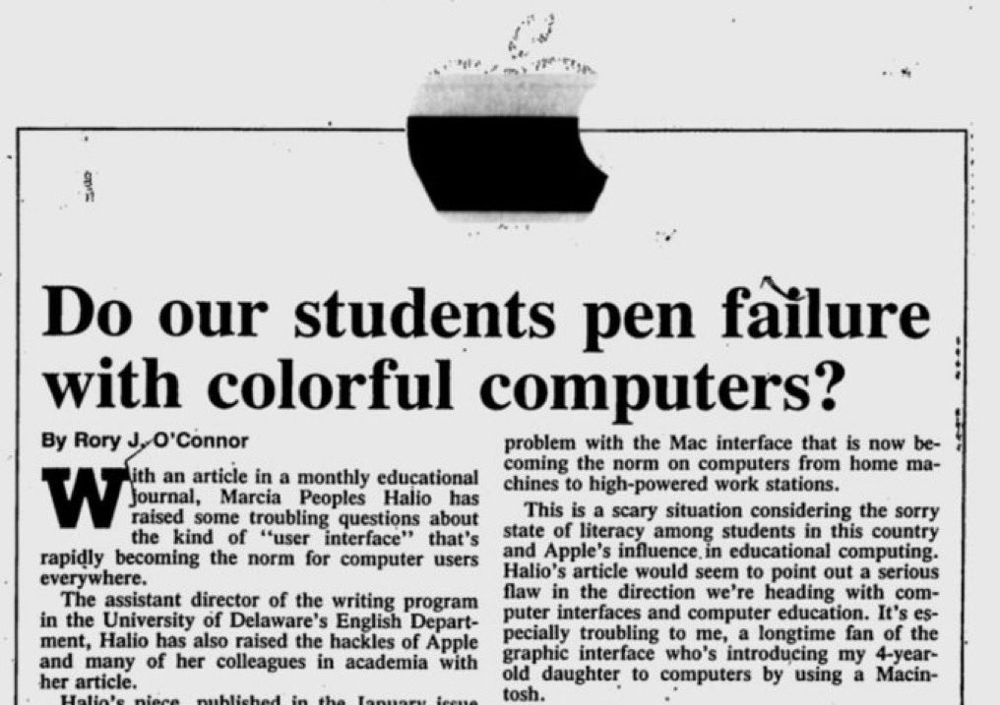
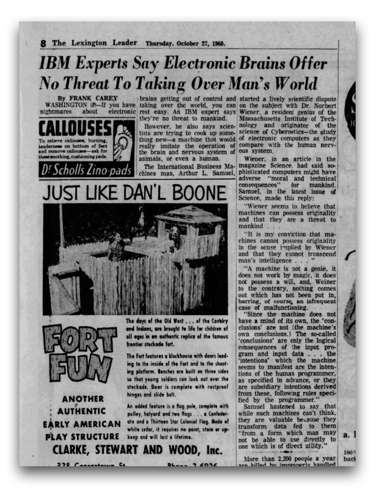
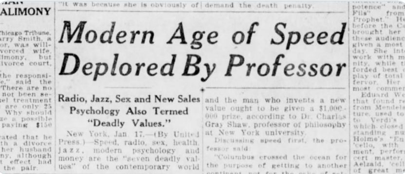

In Plato's *Phaedrus*, over 2,000 years ago, Socrates tells a story about a dangerous new technology that would erode memory, encourage shallow thinking, and give people the illusion of knowledge without the substance.
The technology he was referring to was writing.[^1]

His concern was not aiming for eccentricity.
It was the considered view of one of history's greatest minds.
And he was - in a sense - not entirely wrong.
We do rely on written records rather than memorising everything.
Whether that is a loss or a liberation probably depends on who you ask.

Socrates' concern sounds familiar, we have been here before.
Every generation faces a technology that feels somewhat unsettling.
The printing press, the telegraph, the telephone, the word processor - each raised concerns that look remarkably familiar in hindsight.
Artificial intelligence is the latest addition in a very long story.

This blog post aims to offer some perspective, and perhaps make the present moment feel more like the beginning of something new rather than the end of something old.

## AI Generates Slop

We're all familiar with this complaint: the new tool is producing poor work, and standards are slipping.
We could blame the technology. It would be more accurate to blame the learning curve.

In the 1980s, desktop publishing software arrived and gave Macintosh users the ability to produce documents that looked professionally typeset. The reaction of some was alarm rather than delight.[^2]
A piece in an educational journal asked, with concern, whether students were producing work that looked polished but read poorly - style masking a lack of substance. 

{fig-alt="Newspaper clipping with the headline 'Do our students pen failure with colorful computers?' from an educational journal in the 1980s. Shared by Pessimists Archive."}

Today, the same concern is framed slightly differently.
"AI slop" - content that is fluent, plausible, and oddly hollow - is a genuine phenomenon.
But it is worth asking what produces it.
A word processor does not write a poor essay.
A desktop publishing tool does not design an ugly leaflet.
And an AI assistant does not generate hollow content on its own accord.
In each case, the output reflects the intent, the skill, and the judgement of the person using it.

The tool amplifies what you bring to it.
That has always been true.
A person who has not learned to think carefully will not suddenly think carefully because they have a powerful new tool.
But a person who has - will find that the tool extends their reach considerably.

This is not a defence of laziness.
It is an argument for investing in understanding how to use AI well, rather than either dismissing it or outsourcing your thinking to it uncritically.

As Jony Ive once observed, when people encounter something new, they instinctively try to reference what's familiar - and judge it by how well it matches the past.

## Professional Identity and the Fear of Being Replaced

There is a particular kind of anxiety that is less about the technology itself and more about what it means for the person using it - or the person being replaced by it.

Consider the London black cab driver.
To earn a licence, a cabbie must pass The Knowledge - a gruelling test requiring the memorisation of around 25,000 streets and thousands of points of interest across London.
It takes most candidates between three and four years to prepare.
It is a remarkable human achievement.

When GPS navigation arrived, some cabbies dismissed it outright.
In a recent CBS News interview, a veteran driver compared Google Maps to a hot dog vendor and himself to Gordon Ramsay.
In his view, the tool simply could not replicate what years of hard-won expertise had built.[^3]
The instinct he is expressing is deeply human and thoroughly familiar.

This example is current, not historical.
Autonomous taxis are currently being trialled in London, with British startup Wayve Technologies already conducting test runs and US company Waymo among those planning to participate.[^4]
The sense that something irreplaceable is being undervalued, remains.

This is worth sitting with for a moment.
The concern is not always "will I have a job".
It is often something quieter and more personal: "will what I have learned still matter".

That is a reasonable thing to wonder.
And it deserves a more thoughtful answer than either "don't worry" or "adapt or be left behind".

## When the Experts Worried Too

If the anxieties of cab drivers and students feel relatable, consider that the most serious concerns about artificial intelligence were voiced not by outsiders looking in, but by the very people who built the foundations of the field.

Dr Norbert Wiener is not a household name, but he arguably should be.
A mathematician and scientist at MIT, Wiener pioneered the field he called *cybernetics* - the study of how systems, whether mechanical or biological, regulate themselves through feedback.
The concepts he developed in the 1940s and 1950s underpin much of what we now call artificial intelligence.[^5]

.](norbert-wiener-portrait.jpg){fig-alt="Historical photograph of Dr Norbert Wiener, mathematician and founder of cybernetics, at work. Sourced from the Pessimists Archive newsletter."}

He was also, from the start, deeply uncomfortable about where it was all heading.

In 1948, his book *Cybernetics* raised the first serious warnings about thinking machines.
A year later, the editor of the New York Times invited him to write about "what the ultimate machine age is likely to be".
His drafts were rejected twice - reportedly too unsettling for a general readership.
The version that survives in the MIT archives contains a warning that feels contemporary despite originating from 1949 - that machines "will do what we ask them to do and not what we ought to ask them to do".

By 1960, Wiener was warning of an "industrial revolution of unmitigated cruelty" - automation displacing workers at a scale society was not prepared for.
These predictions generated headlines and serious debate.
Industry pushed back.
An IBM expert, Arthur L. Samuel, responded that "a machine is not a genie, it does not work by magic" and that nothing comes out of a machine that has not been put in.

{fig-alt="Historical newspaper clippings showing press coverage of the debate between Norbert Wiener's automation warnings and IBM's response. Sourced from the Pessimists Archive newsletter."}

That exchange between a pioneering scientist sounding the alarm and an industry insider urging calm will feel recognisable to those following the AI debate today.
The characters have changed, the argument has not.

Wiener's parting message, after decades of thinking about all of this, was measured: "We can be humble and live a good life with the aid of the machines, or we can be arrogant and die."

He was not against the machines. He was against thoughtlessness.

## Proceeding with Caution

It is not only individuals who resist new technology.
Institutions do too, often with the best of intentions.

In 1983, Harvard University introduced coin-operated word processing terminals across its dormitories, libraries, and classrooms.
The initiative was cautious and carefully managed - the university wanted to understand whether students who were not technically inclined could use computers as everyday writing tools.
Access was structured and monitored.[^6]

Organisations today that require sign-off before staff can use AI tools, or that restrict access while policies are drafted, are operating from a similar - reasonable - instinct.
Moving carefully in the face of genuine uncertainty is not the same as moving badly.

But caution has its own costs - ones that are easier to overlook because they are slower and quieter than the risks being guarded against.
Staff who feel held back while the world moves on can become disengaged.
Teams that are denied the chance to develop familiarity with new tools fall behind not through any fault of their own.
The gap between those organisations that engaged early and those that waited tends to widen before it narrows.

The question for institutions is not simply "is it safe to proceed" but "what are we risking by waiting".

Harvard in 1983 is one instance. But institutional caution around new technology is as old as the technologies themselves.

## Every Age Has Its Concerns

In 1926, a professor at New York University gave an interview reported under the headline *"Modern Age of Speed Deplored By Professor"*.
Radio, jazz, new psychology, and modern commerce fell under the "seven deadly values" of contemporary life.
There is a quote that stands out across the intervening century - that another age "would have hesitated to annihilate space and time the way we grind them up in our machines".[^7]

Swap "radio" for "social media" or "AI" and the sentence barely needs editing.

{fig-alt="Newspaper clipping with the headline 'Modern Age of Speed Deplored By Professor' from 1926, warning against radio, jazz, and new psychology. Shared by Pessimists Archive."}

The speaker and their language sound familiar. 
It is a professor - an educated, credentialed authority - expressing alarm about the pace of change.
This is not a fringe view or a tabloid panic.
It is a considered, serious concern from someone who, in most other respects, probably knew a great deal.

That is perhaps the most honest thing to acknowledge about technophobia across the ages - it is not a sign of being uninformed.
It is a very human response to genuine uncertainty.
The printing press did change how knowledge was produced and who controlled it.
The telephone did change the texture of social life.
Radio did reshape politics and culture in ways that were not all benign.

The question has never been whether a new technology will change things.
It always does.
The question is whether we engage with that change deliberately, or simply react to it.

## Conclusions

Socrates worried that writing would hollow out human memory.
A professor in 1926 worried that radio was grinding up the fabric of civilised life.
In 1983, Harvard worried that word processors might change writing in ways it could not yet predict.
A pioneering AI scientist spent decades warning that machines would do what we asked rather than what we ought to ask.
A London cab driver worries that a lifetime of hard-won expertise is about to be made redundant.

None of these people were being unreasonable.
All of them were responding, in good faith, to something that felt genuinely uncertain.

And yet here we are - reading, writing, coding, navigating, and working with tools that each generation before us found cause to question.
The concerns did not stop the technology.
But they did shape how it was adopted - slowly, with friction, and with enough pushback to force developers and institutions to take human costs seriously.

That friction is not always comfortable to sit in.
If you are working in an organisation that feels slow to move, or if you find yourself uncertain about when and how to use AI tools, or if the whole conversation feels exhausting - that is a reasonable place to be.
It does not mean you are behind.
It may mean you are paying attention.

As Jony Ive observed, when people encounter something new, they instinctively try to reference what's familiar - and judge it by how well it matches the past.[^8]
That instinct is human and understandable.
But it is not the same as engagement.

Tradition, as Mahler said, is not the worship of ashes - it is the preservation of fire.[^9]

The most useful thing any of us can do right now is probably the same thing Wiener was asking for in 1949.
Erich Fromm put it plainly: *"Creativity requires the courage of letting go of certainty."*[^10]
Those who have navigated it best have tended to engage thoughtfully, ask good questions, and resist the pull towards both uncritical enthusiasm and reflexive resistance.

The technology will keep moving.
The steadier we are in how we meet it, the better the outcomes are likely to be - for the people using it, and for the people affected by it.

---

[^1]: Plato, *Phaedrus*, 274c-275b. [Perseus Digital Library, Tufts University](https://www.perseus.tufts.edu/hopper/text?doc=Perseus%3Atext%3A1999.01.0174%3Atext%3DPhaedrus).

[^2]: Pessimists Archive. "Desktop publishing was blamed for ruining college essay quality." [Pessimists Archive, May 2026](https://nitter.net/PessimistsArc/status/2056871747152928875).

[^3]: CBS News / 60 Minutes. "London black cab drivers face the rise of autonomous taxis." [CBS News, May 2026](https://www.cbsnews.com/news/london-black-cab-robotaxi-ai-60-minutes/).

[^4]: Fortune. "Self-driving taxis hit London, a city with such complex streets that it has a 'Knowledge' test that takes cabbies years to pass." [Fortune, February 2026](https://fortune.com/2026/02/23/self-driving-taxis-london-what-is-the-knowledge-street-test/).

[^5]: Pessimists Archive. "The Original AI Doomer: Dr. Norbert Wiener." [Pessimists Archive Newsletter](https://newsletter.pessimistsarchive.org/p/the-original-ai-doomer-dr-norbert).

[^6]: Inside Higher Ed. "Harvard's 1983 Experiment with Coin-Operated Word Processors." [Inside Higher Ed](https://www.insidehighered.com/blogs/technology-and-learning/harvard%E2%80%99s-1983-experiment-coin-operated-word-processors).

[^7]: Pessimists Archive. "1926 screed against radio - 'annihilating space and time'." [Pessimists Archive, May 2026](https://nitter.net/PessimistsArc/status/2056784678753866086).

[^8]: Jony Ive, in conversation with Cleo Abram and Flavio Manzoni. 
*Huge Conversations: Iconic Sports Car Ferrari.* [YouTube, May 2026](https://youtu.be/K-o0r2zSgCE).

[^9]: Gustav Mahler, as quoted in the same conversation by Flavio Manzoni: 
"Tradition is not the worship of ashes. Tradition is the preservation of fire."

[^10]: Erich Fromm, as quoted by Flavio Manzoni in the same conversation.
