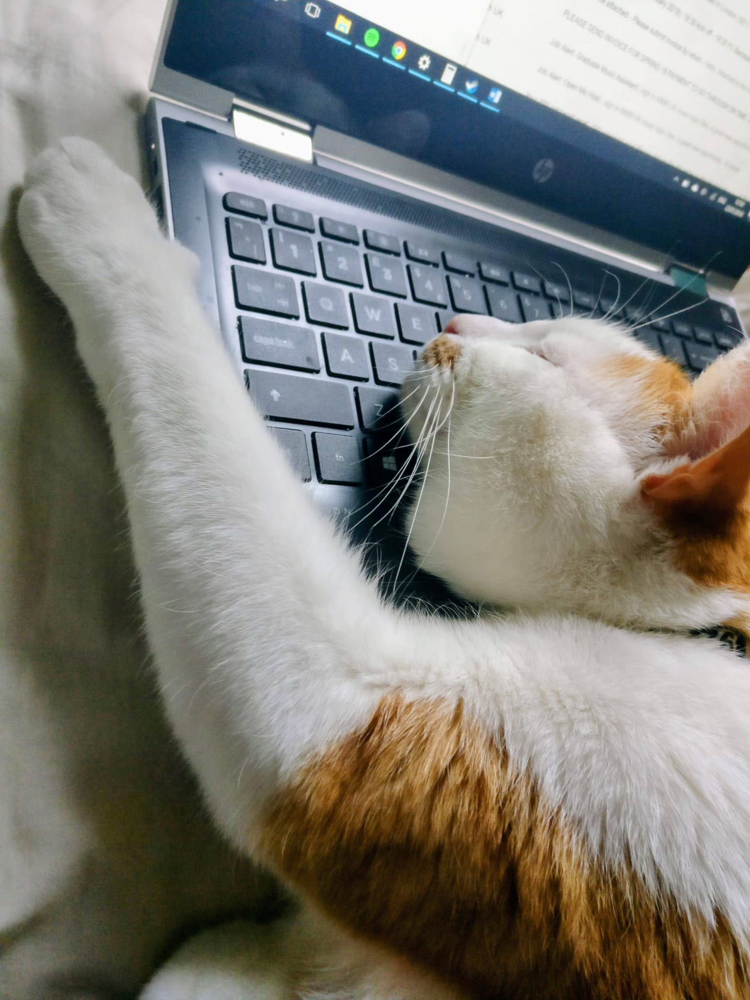
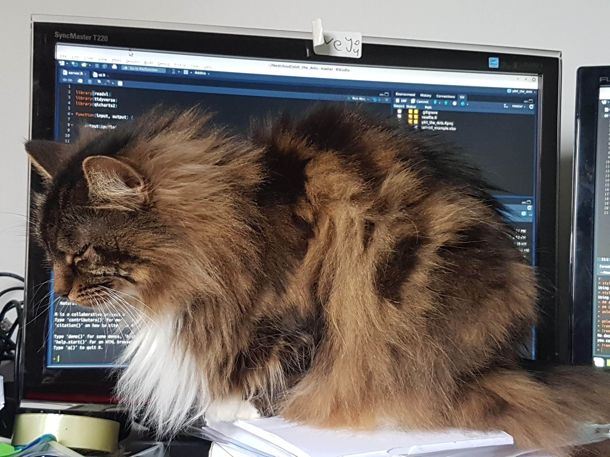
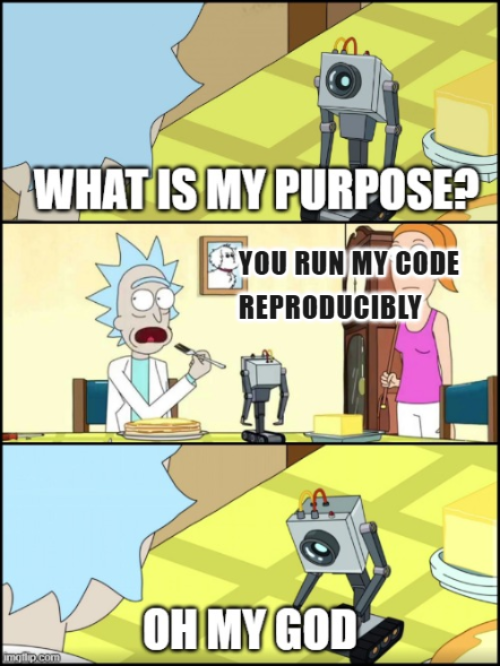

## Storytime #1

:::: {.columns}

::: {.column width="50%"}
* Ronald worked on a project last year. He did some quick analysis and saved his scripts.
* He's revisiting the project now but the code isn't running because one of the functions has now been deprecated.
:::

::: {.column width="50%"}
{fig-alt="An orange tabby cat lying on a laptop keyboard, asleep" fig-align="center" width="75%"}
:::

::::

## Storytime #2

:::: {.columns}

::: {.column width="50%"}
* Freud's finished working on a data pipeline! It runs on his machine.
* However his colleague Pavlova can't run it on her laptop because she don't know what package versions she needs to install.
:::

::: {.column width="50%"}
{fig-alt="A fluffy brown cat sitting in front of a computer screen, looking both sleepy and mildly annoyed. RStudio is displayed on the computer screen, obscured by her fluff" fig-align="center"}
:::

::::

## Steps

There's plenty to discuss, but we'll focus on:

* Basic portability
* Environment managers
* Containers

Roughly: 'the least you can do right now' to 'probably the best choice long-term'.

## Step 1: portability

* Can you 'lift and shift' your whole, discrete project?
* Does the recipient have everything they need?
* Consider IDE-specific helpers ([VS Code Workspaces](https://code.visualstudio.com/docs/editing/workspaces/workspaces), [R Projects](https://docs.posit.co/ide/user/ide/guide/code/projects.html))

::: {.notes}
* You should be able to hand-over a discrete folder that contains everything needed to recreate the work.
* Some integrated development environments have features top encourage this.
:::

## Step 1: portability

Helpers for Python:

- `os.path.join` for OS-agnostic filepaths
- `.env` files and the `dotenv` package for environment variables

For R:

- [`.Rproj` and {here}](https://rstats.wtf/practice-safe-paths)
- an [`.Renviron`](https://docs.posit.co/ide/user/ide/guide/environments/r/managing-r.html#renviron) file

::: {.notes}
* Live demonstration goes here showing what these functions are doing.
* File paths in scripts should be 'relative' (to where the request is coming from), not 'absolute' (from the root of the computer it's being run on).
* Store personal keys and other variables in gitignored files, which the recipient must have their own copy of.
:::

## Step 2: environment managers

* Record language and package versions at a specific time.
* Like a time capsule, "freeze" your programming environment.

{fig-alt="A gif showing Arnold Schwarzenegger as Mr Freeze in Batman & Robin (1997), with the caption 'Lets kick some ice!'." fig-align="center"}

## Step 2: environment managers

For Python:

- there's many, _many_ different options ([see table here](https://pythonhealthdatascience.github.io/des_rap_book/pages/guide/setup/environment.html))
- [we use `uv`](https://docs.astral.sh/uv/) in the DS team and recommend it

For R:

* {renv} with [caveats](https://rstudio.github.io/renv/articles/renv.html#caveats) (see [Shannon's talk](https://www.youtube.com/watch?v=l01u7Ue9pIQ))
* version-switching (try [Positron](https://positron.posit.co/managing-interpreters.html), [rig](https://github.com/r-lib/rig))
* [rv](https://a2-ai.github.io/rv-docs/)?

::: {.notes}
* Live demonstration goes here
* Tooling in R is developing, but isn't as strong or diverse as for Python.
* People seem to use {renv} a lot, it lets you install and snapshot packages so others can later restore.
* But it isn't a perfect solution: it doesn't handle external system dependencies including RTools for Windows; binaries may not be available from package repositories (e.g. CRAN), or need compilation.
* Switching R versions is also not handled. It's possible manually, but ugh.
* rv is a tool that sits outside of R and works differently (see uv later).
:::

## Step 3: containers

:::: {.columns}

::: {.column width="50%"}

- [Docker](https://www.docker.com/) 🐳 / [nix](https://nixos.org/) ([{rix}](https://docs.ropensci.org/rix/) for R)
- Recreates the WHOLE MACHINE, not just the environment!
- Docker creates a temporary virtual computer with the sole purpose of running your script

:::
::: {.column width="50%"}
{fig-alt="Meme from Rick and Morty cartoon. Shows a small robot asking Rick 'What is my purpose?'. Rick replies 'You run my code reproducibly'. The robot, disillusioned, says 'oh my god'." fig-align="center" width="75%"}
:::
::::

## What are you trying to achieve?

Do you want to make your project:

* work right now on someone else's machine?
* work reliably again in future?
* easier to work with collaboratively?

Bottom line:

* you have to make conscious decisions
* different projects need different solutions

::: {.notes}
* What mode? Are you sharing, recreating, reproducing?
* What timescale? Now, the short-, medium- or long-term?
* Do you want to freeze the project in place forever, or occasionally make use of newer package versions?
:::
