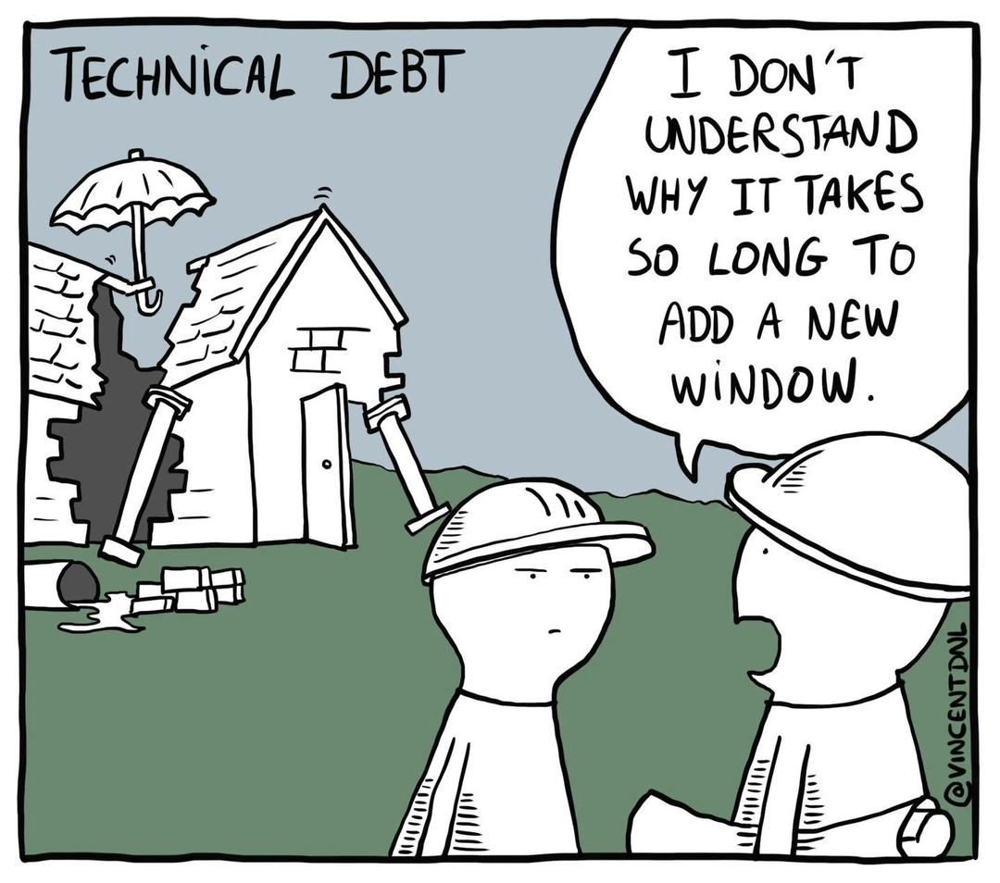
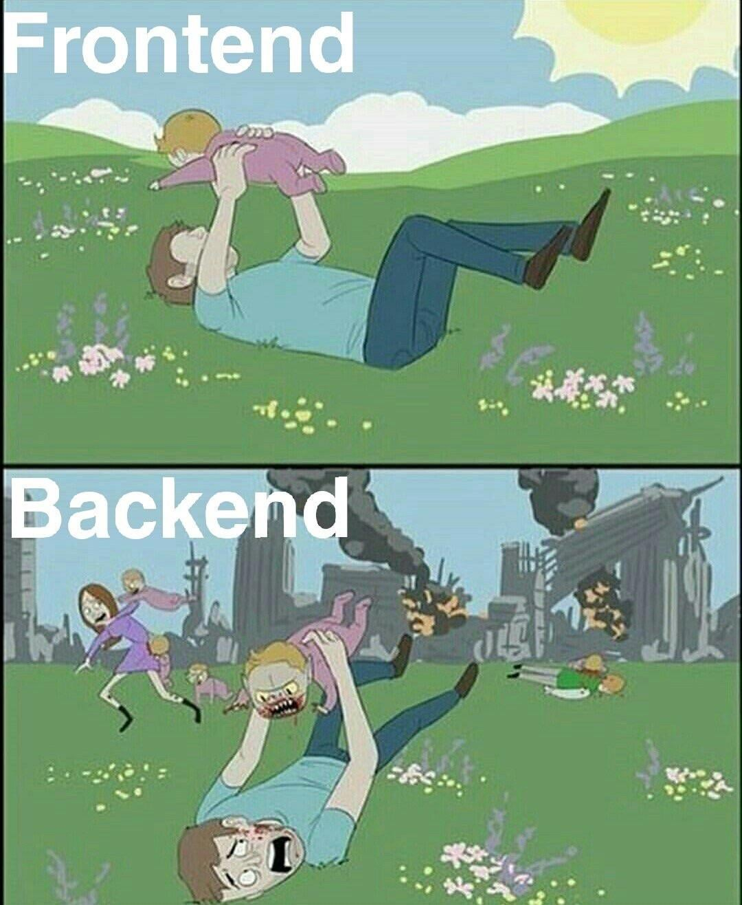

## Tech debt {.nostretch}

{fig-alt="A foreman in front of a broken house saying 'I don't understand why it takes so long to add a new window'" width="50%"}

## OK, that's it, done

## OK, one more

{fig-alt="A picture of frontend and backend. The frontend is a cute scene with a baby. The backend is the same place but shot the other way and reveals a burning city and the baby is a zombie trying to kill the man" width="50%"}

## All done

## OK, fine...

* With great power comes great responsibility
* We can do whizzy things very quickly now but there are hidden pitfalls
* The promise of data science tools and the data science team is speed and reusability

## A formal apology

* To my brilliant team and anyone else who knows technical stuff
* I am mangling stories and concepts here
  * Partly deliberately to help understanding
  * Partly through ignorance
* I'm sorry! Please avert your eyes if I say something stupid
* The points I'm making are about culture and practice, so ignore the technical stuff, wrong and right, and listen to what I'm saying about how we need to work

## Issues arising

* Moving from each project having its own data pipelines to reusing data pipelines
* Moving from each project having its own methods and definitions to reusing methods and definitions
* Moving from one off to repeatable analyses
* Moving from reports to interactive products
* Pace, pace, pace, pace, pace, pace, pace, pace, pace, pace, pace, pace
* If there is time more stuff on pace

## Story time

* When I started, (Jan 2023) the civil servants running NHP wanted to populate a huge spreadsheet
* We built an app instead, to help the parameters be correct
* Because iteration was important and the results complex, we also built an outputs app so people could self serve the model runs
* After some early niggles both ended up being very useful and valued by users

## Job done

{fig-alt="Spongebob squarepants dusting his hands off"}

## But wait!

* We have these whizzy tools, let's get more out of them
* Because it requires a login, people are printing 92 pages of graphs off the app and emailing them
  * TPMA explorer!
* As more schemes come on board and run more models the system that finds the model runs gets really slow
  * Azure table storage!
* Let's have a scenario comparison tool
  * Reskit!

## Techdebt!

* Welcome all to the wonderful and strange land of techdebt
* Sometimes you made something whizzy and great and people want more
* Sometimes you knew you hacked it together too quickly and it would need fixing
* In either case this techdebt will be chained to your ankle until you fix it 
* And while you're fixing it absolutely nothing visible happens at all, which customers *love*

## TPMA explorer

* People are printing 92 pages of a dashboard, surely we can just repurpose the inputs app
* Let's add in local authority data, that can't be too hard can it?
* But wait! There's an inconsistency in our age standardisation across NHP products that needs fixing
* ...two months spent fixing the age standardisation methodology

## TPMA explorer

* Sorted, now we can just repurpose the inputs dashboard to show TPMAs across organisations
* But wait! The inputs dashboard was only ever designed to hold data for one organisation at once
* ...lots of workarounds in some of the outputs to minimise the amount of data in memory at startup

## Azure table storage

* The system that finds the model runs used to work by just looking at every model run
* Like in a library, it just started at the first book and went book by book
* This works great with 20 model runs
* It does not work great with 1,000
* Let's add a library catalogue so the system can know where to find a model run
* Simple enough

## But wait!

* There are a huge number of products and processes that use the old method
* There isn't time to write code to allow every product to use the new method
* So for a while we have to worry about both the old way and the new way
* I'm not going to pretend to understand the change but it was big, complicated, and *necessary* (and invisible)

## Scenario comparison

* Users want to compare scenarios
* Everyone's busy so let's not overcomplicate it, let's just copy code from the results app
* ...coding please wait...
* Done
* But wait!
* What happens when we change the results app? Or we find a bug
* We have to copy the code across

## Reskit to the rescue

* Reskit *abstracts* the functions from the results applications
* Now we can change the function in one place and it will appear everywhere reskit is used
* Reskit is brilliant and essential and takes time to produce and time to wire in place of the old
* This is the true cost of reuse- it's not free and it's not simple

## One more on TPMAs

* TPMA explorer is being pushed out into the wild, let's have a conversation about refining their presentation
* ...conversations... changes to TPMA explorer... done
* But wait! The TPMAs are in the inputs app and now they look different
* That will confuse people who are looking at both

## Let's talk about QA

* Hello! I'm an imaginary person with a report to QA
* I show it to some analysts and they check the numbers
* I show it to my boss to check the messaging
* Done!

## QA of an app

* Hello! It's me again. Everyone liked the report so much I made it into an app
* I show it to some analysts who have to check lots of different states of the application
* I show it to my boss who can't QA properly because they can't check every state of the application

## QA of a -verse

* Hello! We're an 11 person data science team and we have built loads of products in the NHP-verse
* I show a change in a product to some analysts who have to check lots of states of the application
* Then I remember that the code actually affects something else so I show them that too
* A bug is reported in the underlying data so I fix that

## More QA

* Then they all QA all of it again
* Then I remember the change in the data is visible in something I didn't change
* Yet more QA
* My boss have given up even trying to follow at this point

## Tech debt {.nostretch}

{fig-alt="A foreman in front of a broken house saying 'I don't understand why it takes so long to add a new window'" width="50%"}

## What to do?

