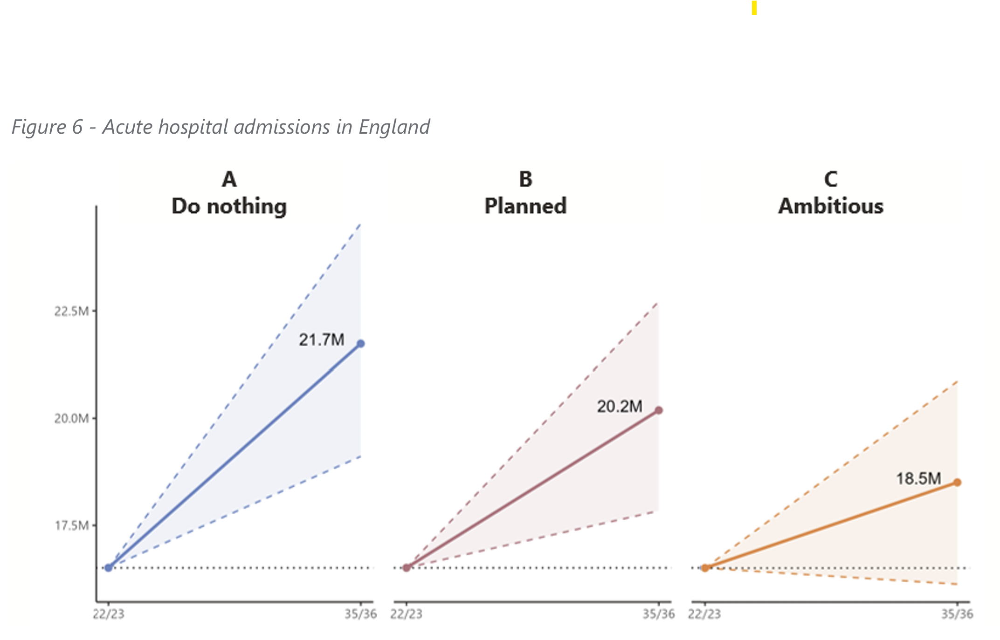

## What are TPMAs anyway?

Types of Potentially Mitigatable Activity: Hospital activity that could be reduced by deliberate action, through:

* Prevention
* De-adoption
* Redirection/substitution
* Hospital efficiency

We have identified this in patient-level data in the Hospital Episode Statistics dataset up to the 2024/25 financial year as part of the NHP (New Hospital Programme) model.

## How have the TPMAs been used so far?

::: {.columns}

:::: {.column width='60%'}

* NHP schemes use the TPMAs to shape discussions with clinicians, ICBs and community providers on what is/isn't possible in their context
* [High-level analyses](https://www.strategyunitwm.nhs.uk/sites/default/files/2025-09/Future%20Demand%20for%20Community%20Care.pdf) estimating future demand for healthcare services (regionally or nationally)

::::

::: {.column width='40%'}

::::

:::

## Session aims

* Answer questions from SU analysts on how to work with TPMAs
* Co-create documentation for us to maintain collaboratively

⚠️🤓 This is quite a technical nitty-gritty session aimed primarily at analysts

## How is this session going to work?

* Pick a question from [the Wiki](https://github.com/The-Strategy-Unit/TPMAs/wiki)
* Work out the answer together
* Add the answer (in your own words) to the Wiki

The Wiki is a living, co-created document - feel free to edit and add things to it as you use TPMAs and questions arise. Breakout rooms to start:

* Examples of TPMA tasks with Gabriel
* How are the TPMAs generated? with YiWen
* Where does TPMA data live? with Matt and Fran