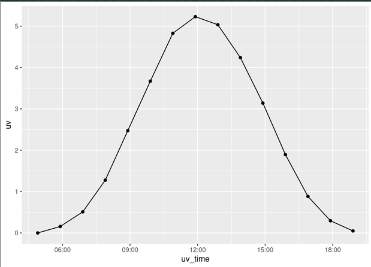

## What is vibe coding *not*

* Vibe coding is not using AI as part of a software development workflow
* Software engineers and data scientists use a lot, a little, or no AI in their work
* The important difference is they design, read, and check the code

## What is vibe coding?

* Writing code in natural language
* Karpathy [described it](https://en.wikipedia.org/wiki/Vibe_coding) "fully give in to the vibes, embrace exponentials, and forget that the code even exists"

## My experience with vibe coding

* I've never used AI to write code at work because it wasn't good enough at that time
* But I have started to use it for a couple of things for myself
* I started with what I would call "vibe-lite coding"
* It was so successful that I went full vibe for the next project

## Vibe-lite coding

* I have elevated skin cancer risk so I'm obsessed with the UV index
* I don't trust the clouds!
* So I built this with my own two brain cells

## Next steps

* It's pretty ugly and hard to read so I fed the whole thing into AI
* I asked me to help me see the individual time points as well as tidy up the scale
* I also asked it to add a date
* Now it's much easier to read

## What's the scoreline people vs clankers?

* I did the groundwork here
  * Set up the API call and drew the graph
* AI helped with a daily refresh of the graph (team effort)
* The formatting and adding a date to the page was all clanker
* I did the copying and pasting into the RStudio window, and I did all the git commits

## Could anybody do this?

* I'm not really sure
* I did a lot of faffing around with environment variables, APIs, and deployments
* I'd love to go back to the beginning of this project and see if the AI could do it with no help
* Do tell me what you think at the end

## Real vibe coding

* Inspired, I tried real vibe coding
* Let's have a look at the end product first

## The tools of real vibe coding

* Agentic AI
* You type in a little box to the right and the agent changes the code
* Let's have a look at that now

## People vs clankers scoreline again

* I didn't write any of the code for this one
* I did set up the GitHub repository and using Git is vital IMO
* I pressed a few buttons to deploy it onto GitHub
* I did manually record all the sound and fix all the filenames
* And let's go back and look at the AI and the mistake it made after prompting

## A note on *real* vibe coding

* Doing it properly requires multiple agents
* You get the AI to write a plan, then you approve the plan
* Bots to write, bots to review, bots to test, bots to deploy
* I haven't done this and don't need to for my stupid stuff
* But that's what you need to get the best results

## Vibe codez 4 life

* I need stupid web apps in my life
* I know lots of people are doing this all over the world now
* Give it a try

## Caveats

* I do (slightly) know what I'm doing
* I know what's possible
* I can fix silly problems more easily myself than I can explain them to an AI

## Go on Chris, talk about work at the end

* Nobody wants a vibe coded OpenPlan
* On the whole I think it's managers, not devs, pushing AI tools
* But I have an open mind about how vibe coding could be used at work more

## How it might be used

* I know some in my team are interested in using it e.g. to try a different technology
  * "Robot, convert this Shiny to JavaScript"
* And I do wonder if vibe coding could help non technical people throw something on a screen for a conversation
* But I don't know, interested in opinions
